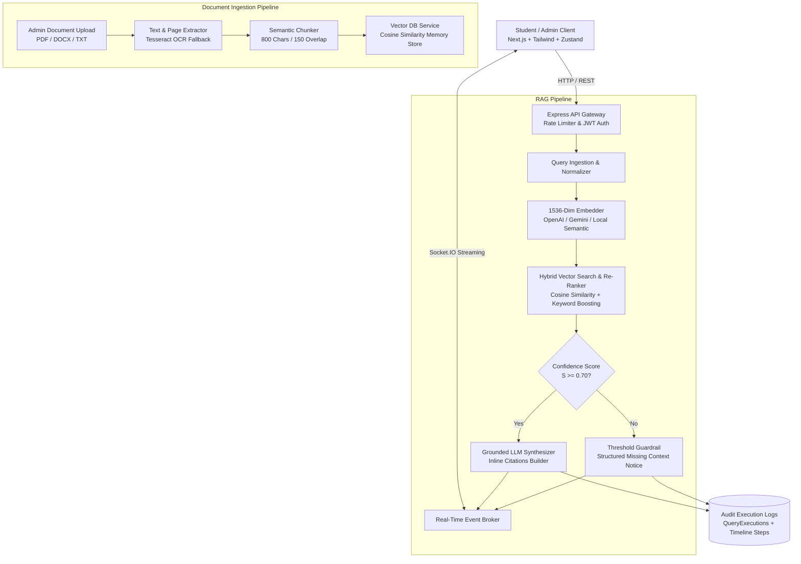

# AI-Powered College Information Assistant (CollegeRAG_AI)


**CollegeRAG_AI** is a full-stack, enterprise-grade AI Operations Platform that empowers students, faculty, and administrators to query official institutional resources—such as admissions guidelines, fee schedules, hostel regulations, examination policies, and placement reports—via **Retrieval-Augmented Generation (RAG)**.

The platform segments uploaded documents into semantic chunks, generates 1536-dimensional vector embeddings, performs hybrid vector similarity searches with cosine distance and keyword re-ranking, and synthesizes grounded answers with granular inline citations and confidence scores.

---

## 🌟 Key Highlights & Features

- 🎯 **Grounded Answer Synthesis**: Strict guardrails ensure answers are synthesized exclusively from official college records, with confidence percentage ratings and inline citations (`[Document Title, Page #]`).
- 🛡️ **Relevance Thresholding & Anti-Hallucination Guardrails**: Queries with a similarity score $S < 0.70$ bypass LLM generation and output an authoritative missing context guidance notice.
- ⚡ **Real-Time Token Streaming**: Real-time response streaming and telemetry step broadcasts powered by Socket.IO.
- 📂 **Multi-Format Ingestion & OCR**: Supports `.pdf`, `.docx`, and `.txt` documents, complete with Tesseract.js OCR for scanned documents and automatic 800-char / 150-overlap chunking.
- 📊 **Audit Execution Engine**: Full telemetry logs for every inquiry tracking duration (ms), token usage, retrieved context chunks, and step-by-step timeline badges (`ingestion`, `retrieval`, `rerank`, `synthesis`).
- 🔐 **Role-Based Access Control (RBAC)**: Secure separation between Student (Query Operators) and Administrator (Document Ingestion & Knowledge Base Managers).
- 🎙️ **Voice-to-Text Querying**: Web Speech API integration for hands-free natural language queries.
- ⚙️ **Zero-Friction Local Fallback**: Automatically activates resilient in-memory storage, in-memory asynchronous queues, and deterministic semantic embedding engines when MongoDB, Redis, or cloud AI keys are not locally available.

---

## 📐 System Architecture



---

## 🚀 Quick Start & Local Setup Guide

### 1. Prerequisites
- **Node.js**: v18.0.0 or higher (`node -v`)
- **npm**: v9.0.0 or higher (`npm -v`)

---

### 2. Backend Setup (`server/`)

1. Open a terminal and navigate to the `server/` directory:
   ```bash
   cd server
   ```

2. Install dependencies:
   ```bash
   npm install
   ```

3. Configure Environment Variables:
   A ready `.env` file is already provided. You can inspect or update `server/.env`:
   ```env
   PORT=5000
   NODE_ENV=development
   CLIENT_URL=http://localhost:3000
   MONGODB_URI=mongodb://localhost:27017/collegerag_ai
   JWT_SECRET=super_secret_jwt_key_for_collegerag_ai_2025
   REDIS_HOST=localhost
   REDIS_PORT=6379

   # Optional Cloud AI API Keys (Local smart fallback is active if unset)
   OPENAI_API_KEY=
   GEMINI_API_KEY=

   # RAG Pipeline Configuration
   SIMILARITY_THRESHOLD=0.70
   TOP_K_CHUNKS=4
   CHUNK_SIZE=800
   CHUNK_OVERLAP=150
   ```

4. Start the Backend Server:
   ```bash
   npm start
   ```
   > 🚀 The server will launch on `http://localhost:5000` and automatically index the pre-loaded official college documents.

---

### 3. Frontend Setup (`client/`)

1. Open a new terminal and navigate to the `client/` directory:
   ```bash
   cd client
   ```

2. Install dependencies:
   ```bash
   npm install
   ```

3. Start the Next.js Development Server:
   ```bash
   npm run dev
   ```
   > 💻 The frontend interface will be live at `http://localhost:3000`.

---

## 🔑 Pre-Configured Demo Credentials

The system comes pre-seeded with two accounts for immediate testing:

| Role | Email | Password | Permissions |
| :--- | :--- | :--- | :--- |
| **Administrator** | `admin@college.edu` | `Admin@123` | Upload/Delete Docs, Re-index, Audit Logs, Settings |
| **Student** | `student@college.edu` | `Student@123` | RAG Chat, Voice Query, Citations, Feedback |

> 💡 *Note: You can also use the 1-Click Login buttons on the `/login` page.*

---

## 📚 Seeded Institutional Knowledge Base

The platform includes 5 pre-indexed institutional documents:

1. **Admissions & Enrollment Handbook 2025-2026** (`Admissions_Guide_2025.txt`)
   - *Key topics*: Eligibility criteria, AEEE entrance dates (May 18-20, 2025), $75 application fee, document verification checklist, lateral entry rules.
2. **Fee Structure and Scholarship Regulations 2025** (`Fee_Structure_and_Scholarships_2025.txt`)
   - *Key topics*: Semester tuition fees ($4,200 for CS/AI), $1,800 hostel fee, Presidential Merit Scholarship (50% waiver for GPA > 9.2), late payment penalties.
3. **Hostel Code of Conduct and Mess Timings** (`Hostel_Rules_and_Mess_Timings.txt`)
   - *Key topics*: Curfew rules (10:00 PM weekdays), dining mess breakfast/lunch/dinner hours, night-out approval rules, prohibited dorm items.
4. **Academic Regulations, Grading System & Exam Manual** (`Exam_Regulations_and_Grading_Policy.txt`)
   - *Key topics*: Mandatory 75% attendance policy, 10-point grading scale (O, A+, A, B+), 14-day re-evaluation window.
5. **Campus Placements & Career Report 2025** (`Placement_Brochure_2025.txt`)
   - *Key topics*: Average package (₹18.5 LPA / $92,000), top recruiters (Google, Microsoft, Amazon), 96.8% placement rate, mandatory 3rd-year internships.

---

## 🧪 Sample Prompts to Try

| Question | Expected Result |
| :--- | :--- |
| *"What is the tuition fee for Computer Science per semester?"* | Grounded answer citing `Fee_Structure_and_Scholarships_2025.txt` with $4,200 per semester. |
| *"What are the hostel curfew hours and mess breakfast timings?"* | Cites `Hostel_Rules_and_Mess_Timings.txt` with 10:00 PM curfew and 7:30 AM breakfast. |
| *"What is the minimum attendance required to write exams?"* | Cites `Exam_Regulations_and_Grading_Policy.txt` with 75% requirement. |
| *"How to prepare quantum lasagna on Mars?"* | Triggers **Score < 0.70 guardrail** with structured unknown question response. |

---

## 🔌 API Endpoints Reference

### Health & Auth
- `GET /api/health` — System heartbeat, vector DB stats, and uptime
- `POST /api/auth/register` — Register student or admin account
- `POST /api/auth/login` — Authenticate and receive JWT
- `GET /api/auth/me` — Fetch current user profile

### Knowledge Base & Document Management
- `GET /api/documents` — List documents with category and search filtering
- `POST /api/documents/upload` — Upload `.pdf`, `.docx`, or `.txt` (Admin only)
- `GET /api/documents/:id` — Inspect document metadata and chunk breakdown
- `DELETE /api/documents/:id` — Delete document and purge vectors (Admin only)
- `POST /api/documents/:id/reindex` — Trigger chunking and re-embedding (Admin only)

### RAG Assistant & Feedback
- `POST /api/chat/query` — Execute RAG inquiry with vector retrieval and citations
- `GET /api/chat/conversations` — Fetch user's conversation threads
- `GET /api/chat/conversations/:id` — Fetch conversation messages
- `POST /api/chat/feedback` — Submit thumbs up / down feedback

### Admin & Auditing
- `GET /api/admin/stats` — Operational dashboard metrics (latency, resolution %, feedback)
- `POST /api/admin/seed` — Re-seed sample documents and accounts
- `GET /api/executions` — List historical query execution logs
- `GET /api/executions/:id` — Granular timeline steps and retrieved chunks

---

## 🛠️ Technology Stack

- **Frontend**: Next.js (Pages Router), React 18, Tailwind CSS, Zustand, Axios, Socket.IO Client, Lucide React Icons.
- **Backend**: Node.js, Express, Socket.IO, Helmet, Morgan, Compression, Express-Validator, Express-Rate-Limit, BCrypt.js, JSON Web Tokens.
- **RAG & Vectors**: In-Memory Cosine Similarity Vector Index (Chroma/Pinecone compatible), OpenAI API (`text-embedding-3-small`, `gpt-4o-mini`), Google Gemini 1.5 Flash, Semantic Term Vectorizer.
- **Document Processing**: `pdf-parse`, `mammoth` (DOCX), `tesseract.js` (OCR).
